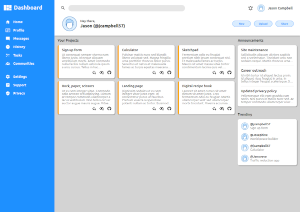

# Admin Dashboard

## Project info

A responsive layout using CSS grid and flexbox. The purpose of this project was to practice creating an interface with CSS Grid. This is the capstone project of [The Odin Project's Intermediate HTML and CSS course](https://www.theodinproject.com/paths/full-stack-ruby-on-rails/courses/intermediate-html-and-css).

Project description can be found [here](https://www.theodinproject.com/lessons/intermediate-html-and-css-admin-dashboard).

## Live demo

Live demo available [here](https://jcampbell57.github.io/odin-admin-dashboard/)

## Table of Contents

* [Features](#features)
* [Technologies utilized](#technologies-utilized)
* [Learning outcomes](#learning-outcomes)
* [Project screenshot](#project-screenshot)
* [Behind the Scenes](#behind-the-scenes)
* [Installation](#installation)

## Features

- UI built to spec
- CSS Grid
- CSS Flexbox

## Technologies utilized

- HTML5
- CSS3

## Learning outcomes

This project helped to reinforce the following skills:

- CSS Grid
- CSS Flexbox

## Project screenshot

## Behind the scenes

### Improvements

This project could be improved with:

- mobile styling

### Resources

- [This](https://cdn.statically.io/gh/TheOdinProject/curriculum/43cc6ab69fdfbef40d431a65677d2144668930ac/intermediate_html_css/grid/project_admin_dashboard/imgs/dashboard-project.png) is the example given to recreate.
- [CSS reset](https://meyerweb.com/eric/tools/css/reset/)
- [Material Design Icons](https://pictogrammers.com/library/mdi/) for SVG icons.

## Installation

- Clone this repository to your desktop.
- Navigate to the top level of the directory by running `cd odin-admin-dashboard`.
- Open `index.html` in your browser.
